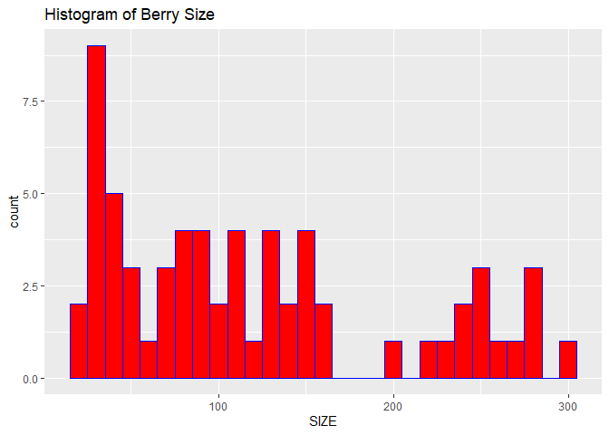
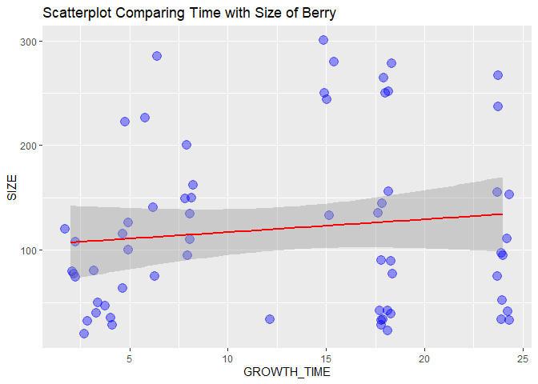
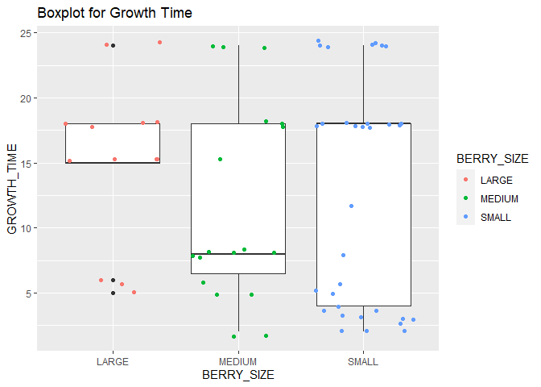
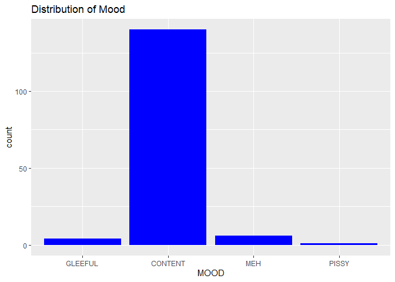
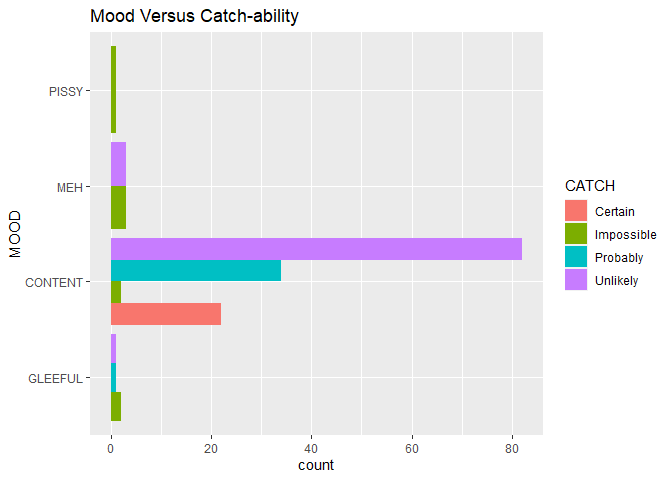
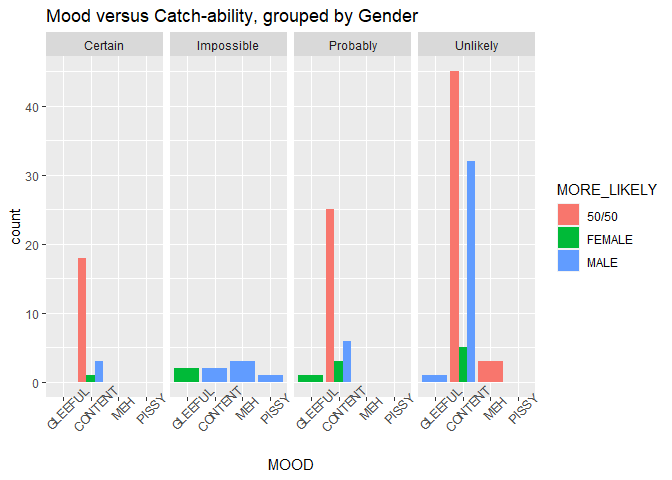

ST 558 Project 1
================
Kristi Ramey
9/23/2021

## Gotta’ Catch Them All!!

## Welcome to my lovely project concerning all things Pokemon!

#### This vignette creates user functions to interact with the Pokemon API and also does some exploratory analysis.

# Libraries needed:

``` r
#Packages needed:
#install.packages("httr")
#install.packages("jsonlite")
#Libraries needed:
library(tidyverse)
library(httr)
library(jsonlite)
library(knitr)
```

# User Functions

## `color_fun`

#### Does your Pokemon match your avatar’s outfit? If not, use my color function to find a Pokemon who won’t cause a fashion faux pas. Type in your favorite `color`, and you will see all the Pokemon you can choose from.

``` r
# Function to get the names of Pokemon of a certain color using 'color' API
color_FUN <- function(color){  
  if(color == "orange"){
    color = "red"
  }  # The API doesn't have 'orange', instead it classifies it as 'red'
  base <- ("https://pokeapi.co/api/v2/pokemon-color/")
  input <- color 
  slash <- ("/")
  api_color <- paste0(base, input, slash)
  pokemondumpCOLOR <- GET(api_color)
  pokemon_color <- fromJSON(pokemondumpCOLOR$url)
  df_pokemon_color <- pokemon_color$pokemon_species[1]
  return(df_pokemon_color)
}
# Some examples (only the 1st six Pokemon are shown)
head(color_FUN("black")) # checking out my rocking code :)
```

    ##       name
    ## 1  snorlax
    ## 2  murkrow
    ## 3    unown
    ## 4  sneasel
    ## 5  umbreon
    ## 6 houndour

``` r
head(color_FUN("orange")) # without the logic statement to switch to red, no bueno
```

    ##         name
    ## 1 charmander
    ## 2      paras
    ## 3 charmeleon
    ## 4  charizard
    ## 5  vileplume
    ## 6   parasect

``` r
head(color_FUN("purple")) # one more for fun!
```

    ##        name
    ## 1   rattata
    ## 2     ekans
    ## 3 nidoran-m
    ## 4     zubat
    ## 5   venonat
    ## 6     arbok

##### Now that you got your Pokemon of a perfect color, let’s find out some info about them!

## `ID_FUN()`

##### First of all, let’s find out your Pokemon’s ID from the Pokedex. The Pokedex is a list of Pokemon in the order dictated by the National Pokedex. A Pokemon’s number and can help you guage when your Pokemon was introduced, and which region it hails from. This ID number can also be used in the `Can_U_Catch()` function.

``` r
# Name to Pokedex ID using 'pokemon' API
ID_FUN <- function(poke_name){  
  base <- ("https://pokeapi.co/api/v2/pokemon/")
  input <- poke_name
  slash <- ("/")
  api_name <- paste0(base, input, slash)
  pokemondumpNAME <- GET(api_name)
  pokemon_name2id <- fromJSON(pokemondumpNAME$url)
  df_pokemon_nameid <- data.frame(input, pokemon_name2id$id)
# Changing Column names into something p'urty.
  names(df_pokemon_nameid) <- NULL
  names(df_pokemon_nameid) <- c("NAME", "Pokedex ID")
  return(df_pokemon_nameid)
}
# Some examples:
ID_FUN("palkia")
```

    ##     NAME Pokedex ID
    ## 1 palkia        484

``` r
ID_FUN("pikachu")
```

    ##      NAME Pokedex ID
    ## 1 pikachu         25

#### Now, you know who you want to catch, but how likely are you to catch your Pokemon?

#### Great question! Let’s find out!

## `Can_U_Catch_FUN()`

#### This function will take in either the Pokemon’s name or it’s Pokedex number and will inform you of your chances of catching the Pokemon.

``` r
# Function to find out catching chances using 'species' API
Can_U_Catch_FUN <- function(poke_name){  
  if(is.numeric(poke_name)){
  ID <- as.character(poke_name) # If Users give Pokedex ID, go straight to API 
  # Just convert # to a character  
  } else { # If User gives the name, covert to ID first
  base <- ("https://pokeapi.co/api/v2/pokemon/") 
  input <- poke_name
  slash <- ("/")
  api_name <- paste0(base, input, slash)
  pokemondumpNAME <- GET(api_name)
  pokemon_name2id <- fromJSON(pokemondumpNAME$url)
  df_pokemon_nameid <- pokemon_name2id$id  
  ID <- as.character(df_pokemon_nameid)} 
# Now, pull the catch rate from different API
  base2 <- ("https://pokeapi.co/api/v2/pokemon-species/")
  slash <- ("/")
  api_species <- paste0(base2, ID, slash)
  api_species
  pokemondumpSPECIES <- GET(api_species)
  pokemon_species <- fromJSON(pokemondumpSPECIES$url)
# Collecting some data
SpeciesINFO <- data.frame(as.character(pokemon_species$name[1]),  as.numeric(pokemon_species$capture_rate[1]))
# Changing Column names into something p'urty.
names(SpeciesINFO) <- NULL
names(SpeciesINFO) <- c("NAME", "CAPTURE_RATE")
SpeciesINFO <- SpeciesINFO %>%
  mutate(CHANCES_OF_CATCHING= if_else(CAPTURE_RATE >= 200, "You're gonna get it!",  
                           if_else(CAPTURE_RATE >= 100, "Pretty good chance",  
                                   if_else(CAPTURE_RATE >= 40, "Not looking good",  
                                           "Sorry, not gonna happen"))))

return(SpeciesINFO)

}
# Examples:
Can_U_Catch_FUN("pidgey")
```

    ##     NAME CAPTURE_RATE  CHANCES_OF_CATCHING
    ## 1 pidgey          255 You're gonna get it!

``` r
Can_U_Catch_FUN("palkia")
```

    ##     NAME CAPTURE_RATE     CHANCES_OF_CATCHING
    ## 1 palkia            3 Sorry, not gonna happen

``` r
Can_U_Catch_FUN(100)
```

    ##      NAME CAPTURE_RATE CHANCES_OF_CATCHING
    ## 1 voltorb          190  Pretty good chance

# Exporatory Data Analysis

## BERRIES

#### Love them like Family, feed them like Family. You want to get the most Bang for your Berry Buck! So, let’s investigate if longer growth times produce larger berries?

``` r
# How many berries are there?
pokemondumpBERRYCOUNT <- GET("https://pokeapi.co/api/v2/berry/")
pokemon_berrycount <- fromJSON(pokemondumpBERRYCOUNT$url)
B <- as.numeric(data.frame(pokemon_berrycount$count)[1])
B  
```

    ## [1] 64

``` r
# Okay, 64, so now lets grab the name, size, max harvest, and growth time  
# with a for loop
df_BerryINFO <- data.frame()
for (i in 1:B){
  base3 <- ("https://pokeapi.co/api/v2/berry/")
  ID = i
  slash <- ("/")
  api_berry <- paste0(base3, ID, slash)
  api_berry
  pokemondumpBERRY <- GET(api_berry)
  pokemon_berry <- fromJSON(pokemondumpBERRY$url)
  # collecting what I want
  BerryINFO <- data.frame(as.character((pokemon_berry$name)[1]),  
                          as.numeric((pokemon_berry$size)[1]),  
                          as.numeric((pokemon_berry$max_harvest)[1]),  
                          as.numeric((pokemon_berry$growth_time)[1]))
  # Storing into a DF
  df_BerryINFO <- rbind.data.frame(df_BerryINFO, BerryINFO)
}
# Changing Column names to something pretty
names(df_BerryINFO) <- NULL
names(df_BerryINFO) <- c("NAME", "SIZE", "MAX_HARV", "GROWTH_TIME")

# FINALLY!  Time to graph! :)
# Creating a histogram of berry sizes
g <- ggplot(df_BerryINFO, aes(x  = SIZE))
g + geom_histogram(binwidth = 10, color = "blue", fill = "red") + labs(title = "Histogram of Berry Size")
```

<!-- --> \#\#\#\# The
Berry Histogram shows that there is a wide range of sizes, but the bulk
are under 100. So how does size compare to growth time?

``` r
#Creating a scatterplot comparing the berry size with the berries' growth time
g1 <- ggplot(data = df_BerryINFO, aes(x = GROWTH_TIME, y = SIZE))
g1 + geom_point(size = 4, alpha = .4, color = "blue", position='jitter') + geom_smooth(method = lm, col = "red") + labs(title = "Scatterplot Comparing Time with Size of Berry")
```

<!-- -->

#### Okay, well, that only showed that there’s practically no correlation between growth time and size. But let’s go further, by making bins out of these numbers!

``` r
# Creating three sizes of berries

df_BerryINFO <- df_BerryINFO %>%  
  mutate(BERRY_SIZE = if_else(SIZE > 200, "LARGE",
                            if_else(SIZE > 100, "MEDIUM", "SMALL")))

g2 <- ggplot(df_BerryINFO, aes(x = BERRY_SIZE, y = GROWTH_TIME))
g2 + geom_boxplot(fill = "white") + geom_jitter(aes(color = BERRY_SIZE)) +
  labs(title = "Boxplot for Growth Time")
```

<!-- -->

#### So, it looks like large berries aren’t as prevelant, they have the smallest IQR. I’m surprised to see that the median growth time for the medium berries are lower than for the small berries…Interesting…

#### How does the yield factor into this? Does that effect growth time? Let’s look, shall we?

``` r
summary(df_BerryINFO$MAX_HARV)
```

    ##    Min. 1st Qu.  Median    Mean 3rd Qu.    Max. 
    ##   5.000   5.000   5.000   6.484   5.000  15.000

``` r
# Looks like the range is 5 to 15 berries...So let's use 10 as the cut off between
# high yield and low

df_BerryINFO <- df_BerryINFO %>%  
  mutate(YIELD = if_else(MAX_HARV >= 10, "HIGH", "LOW"))

TimePerYield <- df_BerryINFO %>%  
# Focus on Yield and Growth Time
  select(YIELD, GROWTH_TIME) %>%
  # Group by Yield
  group_by(YIELD) %>%  
  # Get summary statistics for Growth Time of each Yield
  summarize("Min" = min(GROWTH_TIME),
            "1st Quartile" = quantile(GROWTH_TIME, .25),
            "Median" = quantile(GROWTH_TIME, .5),
            "Mean" = mean(GROWTH_TIME),
            "3rd Quartile" = quantile(GROWTH_TIME, .75),
            "Max" = max(GROWTH_TIME),
            "Stand Dev" = sd(GROWTH_TIME)
  )
# Show off that data!
knitr::kable(TimePerYield,
             caption = "Summary Stats for Growth Time Base on Yield", digits = 2)
```

| YIELD | Min | 1st Quartile | Median |  Mean | 3rd Quartile | Max | Stand Dev |
|:------|----:|-------------:|-------:|------:|-------------:|----:|----------:|
| HIGH  |   2 |         2.00 |      6 |  7.79 |           15 |  15 |      5.82 |
| LOW   |   3 |         5.75 |     18 | 14.28 |           18 |  24 |      7.87 |

Summary Stats for Growth Time Base on Yield

#### Well, isn’t that just the cat’s meow. The lower the Yield, the longer the time it takes to grow the berry. Maybe that’s because the lower Yield produce larger fruit, which would take longer to grow? Let’s take a look around.

``` r
# Table of Berry Size by Yield
knitr::kable(table(df_BerryINFO$YIELD, df_BerryINFO$BERRY_SIZE), caption = paste("Berry Size by Yield"))
```

|      | LARGE | MEDIUM | SMALL |
|:-----|------:|-------:|------:|
| HIGH |     6 |      4 |     4 |
| LOW  |     7 |     14 |    29 |

Berry Size by Yield

#### Hmmm, I had that all wrong. The High Yield produced fairly evenly small, medium, and large. Additionally, the Small Yield produced a ton of small fruit (the most common in the game). Well played, Pokemon.

## POKEMON

#### Now to do some EDA for Pokemon in the Kanto region (the first region released in Pokemon Go) - a total of 151 Pokemon.

``` r
df_speciesINFO <- data.frame()
for (i in 1:151){
  base2 <- ("https://pokeapi.co/api/v2/pokemon-species/")
  ID = i
  slash <- ("/")
  api_species <- paste0(base2, ID, slash)
  api_species
  pokemondumpSPECIES <- GET(api_species)
  pokemon_species <- fromJSON(pokemondumpSPECIES$url)
  # Collecting some data
  SpeciesINFO <- data.frame(as.character(pokemon_species$name[1]), as.numeric(pokemon_species$gender_rate[1]), as.numeric(pokemon_species$capture_rate[1]), as.numeric(pokemon_species$base_happiness[1]), as.logical(pokemon_species$is_legendary[1]), as.logical(pokemon_species$has_gender_differences))  
  # Storing into a DF
  df_speciesINFO <- rbind.data.frame(df_speciesINFO, SpeciesINFO)
                                               
}

# Changing Column names into something pretty
names(df_speciesINFO) <- NULL
names(df_speciesINFO) <- c("NAME", "GENDER_RATE", "CAPTURE_RATE", "BASE_HAPPINESS", "LEGENDARY", "DIFFENT_GENDERS?")
```

#### Now that we have a sweet looking data frame, let’s start grouping different items.

``` r
# Grouping Pokemon's Base Happiness into 4 levels
MOOD <- factor(c("GLEEFUL", "CONTENT", "MEH", "PISSY"))

df_speciesINFO <- df_speciesINFO %>%  
  mutate(MOOD = if_else(BASE_HAPPINESS >= 100, "GLEEFUL",
                        if_else(BASE_HAPPINESS >= 70, "CONTENT",
                                if_else(BASE_HAPPINESS >= 10, "MEH", "PISSY"))))
# Grouping Pokemon's Gender Rate by which gender is more likely
df_speciesINFO <- df_speciesINFO %>%
  mutate(MORE_LIKELY = if_else(GENDER_RATE > 4, "FEMALE",  
                          if_else(GENDER_RATE < 4, "MALE", "50/50")))
# Grouping Pokemon's Capture Rate into 4 levels
df_speciesINFO <- df_speciesINFO %>%
  mutate(CATCH = if_else(CAPTURE_RATE >= 200, "Certain",  
                           if_else(CAPTURE_RATE >= 100, "Probably",  
                                   if_else(CAPTURE_RATE >= 40, "Unlikely",  
                                           "Impossible"))))
# Changing Legendary status from T/F to Legendary/Not Legendary to make it more user friendly
df_speciesINFO <- df_speciesINFO %>%
  mutate(RANK = if_else(LEGENDARY == TRUE, "Legendary", "Not Legendary"))
```

#### Okay, let’s start diving in. First off, Legendary are the most covetted Pokemon. They are not found in the wild. How does the gender division of Legendary compare to the run of the mill Pokemon?

``` r
knitr::kable(table(df_speciesINFO$RANK, df_speciesINFO$MORE_LIKELY), caption = paste("If a Legendary, what gender is more likely?"))
```

|               | 50/50 | FEMALE | MALE |
|:--------------|------:|-------:|-----:|
| Legendary     |     0 |      0 |    4 |
| Not Legendary |    91 |     12 |   44 |

If a Legendary, what gender is more likely?

#### Well, that’s disappointing. Of the four legendary, they are more likely to be male pokemon. That’s kind of dampered my mood, speaking of mood… Let’s break down the different information based on the mood of the pokemon.

``` r
# Finding Average Capture Rate With each mood
df_speciesINFO %>%
  select(MOOD, CAPTURE_RATE) %>%  
  group_by(MOOD) %>%  
  mutate(AVG_CR = mean(CAPTURE_RATE))
```

    ## # A tibble: 151 x 3
    ## # Groups:   MOOD [4]
    ##    MOOD    CAPTURE_RATE AVG_CR
    ##    <chr>          <dbl>  <dbl>
    ##  1 CONTENT           45   112.
    ##  2 CONTENT           45   112.
    ##  3 CONTENT           45   112.
    ##  4 CONTENT           45   112.
    ##  5 CONTENT           45   112.
    ##  6 CONTENT           45   112.
    ##  7 CONTENT           45   112.
    ##  8 CONTENT           45   112.
    ##  9 CONTENT           45   112.
    ## 10 CONTENT          255   112.
    ## # ... with 141 more rows

``` r
# Mood Distribution
# Putting the Ordinal Variables in the right order.
h1 <- df_speciesINFO %>%  
  mutate(MOOD = fct_relevel(MOOD, "GLEEFUL", "CONTENT", "MEH", "PISSY")) %>%  
  ggplot(aes(x = MOOD))  
h1 + geom_histogram(stat = "count", fill = "blue") +
  labs(title = "Distribution of Mood")
```

<!-- -->

#### Looks like majority of Pokemon are content with life.

``` r
# Mood VS Catch-ability
knitr::kable(table(df_speciesINFO$MOOD, df_speciesINFO$CATCH), caption = paste("Mood Versus How Easy They Are To Catch"))
```

|         | Certain | Impossible | Probably | Unlikely |
|:--------|--------:|-----------:|---------:|---------:|
| CONTENT |      22 |          2 |       34 |       82 |
| GLEEFUL |       0 |          2 |        1 |        1 |
| MEH     |       0 |          3 |        0 |        3 |
| PISSY   |       0 |          1 |        0 |        0 |

Mood Versus How Easy They Are To Catch

``` r
# Bar Chart with that same data
h1 + geom_bar(aes(fill = CATCH), position = "dodge") + 
 coord_flip() + labs(title = "Mood Versus Catch-ability")
```

<!-- -->

#### I thought perhaps the happier the Pokemon are, the easier they are to catch, but based on the histogram, sure doesn’t look that way. How in the world can a Pokemon be Gleeful and yet Impossible to catch…maybe that’s why they are gleeful.

``` r
# Mood VS Gender Likelihood
knitr::kable(table(df_speciesINFO$MOOD, df_speciesINFO$MORE_LIKELY), caption = paste("Mood Compared to Gender Likelihood"))
```

|         | 50/50 | FEMALE | MALE |
|:--------|------:|-------:|-----:|
| CONTENT |    88 |      9 |   43 |
| GLEEFUL |     0 |      3 |    1 |
| MEH     |     3 |      0 |    3 |
| PISSY   |     0 |      0 |    1 |

Mood Compared to Gender Likelihood

#### Looks like the largest intersection is Content and 50/50. That makes sense as a standard go-to. Lots of Gleeful Males, but that poor single Pissy Male. I believe that is MewTwo and it is because he was experimented on. I would be Pissy too. Now, let’s bring it all together: Mood, Gender, and Catch-ability.

``` r
# Looking at Mood, Gender, and Catch-ability 
h1 + geom_bar(aes(fill = MORE_LIKELY), position = "dodge") +  
  facet_grid(.~CATCH) + theme(axis.text.x = element_text(angle = 45)) +
  labs(title = "Mood versus Catch-ability, grouped by Gender")
```

<!-- -->

#### Well, there you have it. You now will be a color-coordinated trainer. You know how easily your new bestie will be to catch. And you have the best knowledge of how to keep your Pokemon happy and well fed.

<p align="center">
QED
</p>
